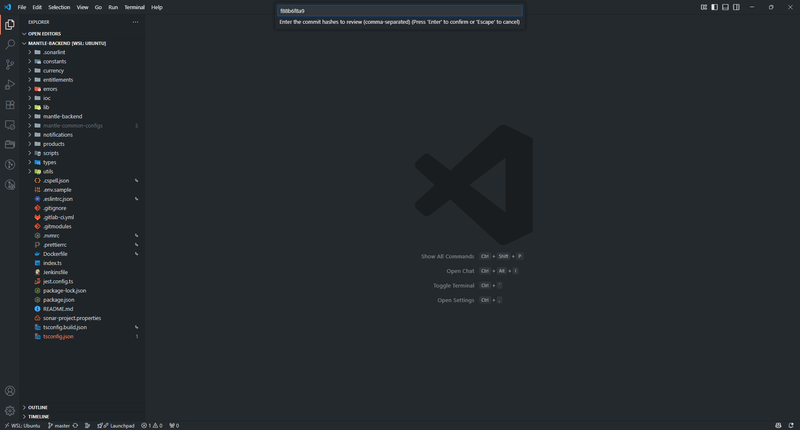
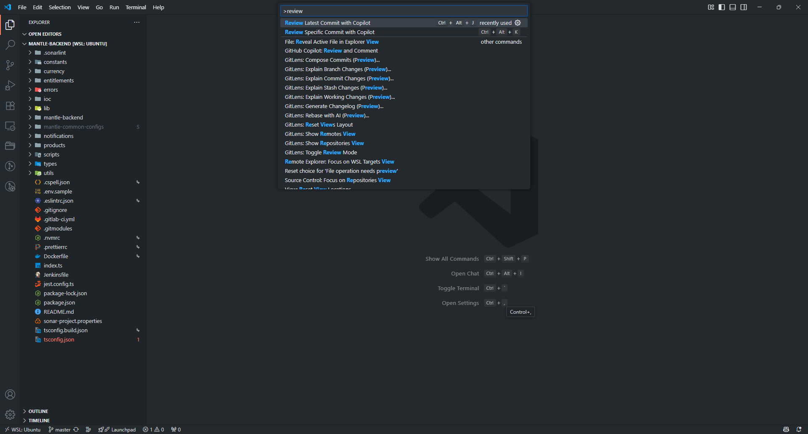
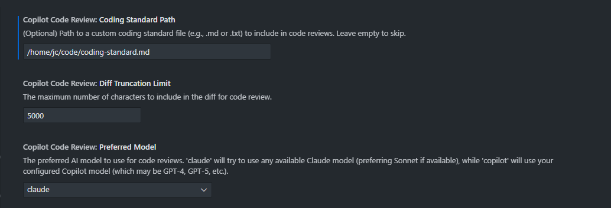
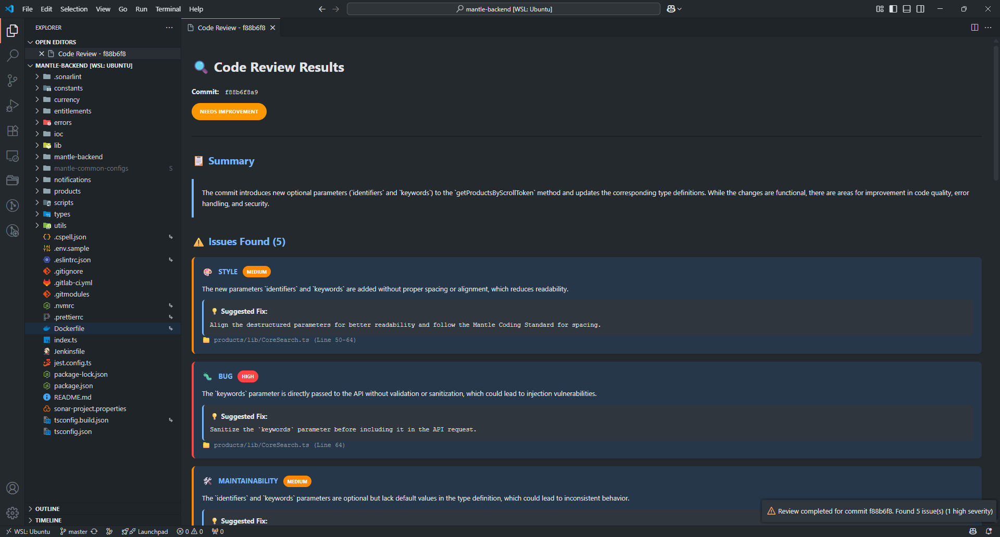

# 🤖 VSCode AI-Powered Code Review Extension

> An intelligent VS Code extension that leverages AI models (Claude and GitHub Copilot) to perform automated code reviews on Git commits.

[](https://github.com/jsegubience/vscode-code-reviewer-extension/releases)
[](LICENSE)
[](https://code.visualstudio.com/)

Get instant, AI-powered feedback on your code changes with comprehensive analysis covering code quality, security, performance, and best practices.

## ✨ Features

| Feature | Description |
|---------|-------------|
| 🧠 **AI-Powered Reviews** | Uses Claude (preferred) or GitHub Copilot to analyze your code changes |
| 🔍 **Comprehensive Analysis** | Covers code quality, security, performance, and maintainability |
| ⚡ **Instant Feedback** | Get reviews in seconds with simple hotkey commands |
| 📝 **Detailed Reports** | Formatted markdown reports with actionable suggestions |
| 🎯 **Flexible Targeting** | Review latest commit or specify any commit hash |
| ⚙️ **Configurable Settings** | Adjust settings to optimize for your workflow |

<!-- Add screenshot here -->


*Demo of the extension in action*

## 🚀 Quick Start

### Installation

**Easy Installation (Recommended):**
```bash
# Download and run the installation script
curl -fsSL https://raw.githubusercontent.com/jsegubience/vscode-code-reviewer-extension/master/install.sh | bash
```

**Manual Installation:**
See the [INSTALL.md](INSTALL.md) file for detailed manual installation instructions.

### Usage
| Action | Hotkey | Command |
|--------|--------|---------|
| Review Latest Commit | `Ctrl+Alt+J` | `Review Latest Commit with AI` |
| Review Specific Commit | `Ctrl+Alt+K` | `Review Specific Commit with AI` |

<!-- Add usage screenshots here -->


*Screenshot available hotkeys*

## ⚙️ Configuration

The extension provides configurable settings to enhance your experience:

<details>
<summary><b>🤖 AI Model Selection</b></summary>

**Setting**: Automatic
- **Default**: Claude Sonnet (preferred), with fallback to other available AI models
- **Purpose**: Determines which AI model is used for code reviews
- **Behavior**: The extension automatically selects the best available model in this order:
  1. Claude Sonnet (any version)
  2. Other Claude models
  3. GitHub Copilot/GPT models
  4. Any other available language model
</details>

<details>
<summary><b>🔧 Diff Truncation Limit</b></summary>

**Setting**: `copilotCodeReview.diffTruncationLimit`
- **Default**: 5000 characters
- **Purpose**: Controls the maximum diff size sent to the AI model
- **Configuration**:
```json
{
  "copilotCodeReview.diffTruncationLimit": 7000
}
```
</details>

<details>
<summary><b>📋 Custom Coding Standards</b></summary>

**Setting**: `copilotCodeReview.codingStandardPath`
- **Default**: Empty (no coding standard enforced)
- **Purpose**: Include your team's coding standards in reviews
- **Configuration**:
```json
{
  "copilotCodeReview.codingStandardPath": "/path/to/your/coding-standard.md"
}
```
</details>

<!-- Add configuration screenshot here -->


*Extension settings in VS Code*

## 📊 What Gets Analyzed

The extension provides comprehensive analysis across multiple dimensions:

### 🏗️ Code Quality
- **✅ Best Practices** - Adherence to established coding conventions
- **🔧 Maintainability** - Code readability and long-term sustainability  
- **📏 Coding Standards** - Consistency with team/project guidelines

### 🔒 Security Analysis  
- **🚨 Vulnerabilities** - Potential security flaws and exploits
- **⚠️ Unsafe Operations** - Risky code patterns and operations
- **🛡️ Security Best Practices** - Recommendations for secure coding

### ⚡ Performance Optimization
- **🚀 Algorithm Efficiency** - Optimal algorithmic approaches
- **💾 Memory Usage** - Memory leaks and optimization opportunities
- **📈 Optimization Opportunities** - Performance improvement suggestions

### 🧪 Testing Coverage
- **❌ Missing Tests** - Identification of untested code paths
- **📊 Coverage Recommendations** - Suggestions for comprehensive testing

### 🐛 Bug Detection
- **🔍 Logic Errors** - Potential runtime issues and edge cases
- **💥 Runtime Issues** - Exception handling and error scenarios
- **🔄 Code Flow** - Control flow and state management problems

## 📋 Output Format

Reviews are presented in a structured, easy-to-read format:

- **🎯 Overall Rating**: Good, Needs Improvement, or Major Issues
- **📄 Summary**: Brief overview of changes and assessment  
- **⚠️ Issues Found**: Categorized by severity and type
- **💡 Suggestions**: Actionable recommendations for improvement

<!-- Add output example screenshot here -->


*Example of a generated code review report*

## 💡 Best Practices

> **💡 Tip**: For optimal results, review **5 or fewer commits** at a time to ensure efficient processing and detailed analysis.

## 🛠️ Development

<details>
<summary><b>🔧 Setup & Build</b></summary>

```bash
# Clone the repository
git clone https://github.com/jsegubience/vscode-code-reviewer-extension.git
cd vscode-copilot-code-review

# Install dependencies
npm install

# Compile TypeScript
npm run compile

# Watch for changes during development
npm run watch
```
</details>

<details>
<summary><b>🧪 Testing</b></summary>

1. Press `F5` to launch Extension Development Host
2. Open a Git repository in the new window
3. Test the extension commands using hotkeys
</details>

<details>
<summary><b>🧩 Component Overview</b></summary>

- **extension.ts**: Registers commands and activates the extension
- **commands/**
  - **reviewLatestCommit.ts**: Handles reviewing the most recent commit
  - **reviewSpecificCommit.ts**: Allows reviewing user-selected commits
- **providers/**
  - **aiReviewProvider.ts**: Manages AI model selection with preference for Claude models, falling back to GPT models when needed
- **utils/**
  - **commitReviewService.ts**: Shared service for commit review functionality across commands
  - **gitUtils.ts**: Git operations like fetching commits and diffs
  - **reviewPresentation.ts**: Formats and displays review results in VS Code
- **types/**
  - **index.ts**: Type definitions used throughout the extension
</details>

<details>
<summary><b>📁 Project Structure</b></summary>

```
src/
├── extension.ts                 # Main extension entry point
├── commands/
│   ├── reviewLatestCommit.ts   # Latest commit review
│   └── reviewSpecificCommit.ts # Specific commit review
├── providers/
│   └── aiReviewProvider.ts     # AI model integration (supports both Claude and Copilot)
├── utils/
│   ├── commitReviewService.ts  # Shared commit review functionality
│   ├── gitUtils.ts             # Git operations
│   └── reviewPresentation.ts   # Review formatting and display
└── types/
    └── index.ts                # TypeScript definitions
```
</details>

## 🔧 Troubleshooting

<details>
<summary><b>❌ "No AI model available"</b></summary>

- ✅ Extension now supports both Claude and GitHub Copilot models
- ✅ Install and authenticate either Claude or GitHub Copilot extensions
- ✅ Check your AI model subscription status  
- ✅ Restart VS Code and try again
</details>

<details>
<summary><b>❌ "Not a Git repository"</b></summary>

- ✅ Open a folder containing a Git repository
- ✅ Initialize Git: `git init`
- ✅ Verify you're in the correct directory
</details>

<details>
<summary><b>❌ "No commits found"</b></summary>

- ✅ Ensure repository has at least one commit
- ✅ Check current working directory
</details>

<details>
<summary><b>⚠️ Merge commits not supported</b></summary>

- ❌ The extension does not work with merge commits
- ✅ Use regular commits for code reviews
- ✅ Consider reviewing individual commits before merging
- 🔄 **Alternative**: Squash commits before creating an MR/PR
- 💡 **Tip**: Review feature branch commits individually for best results
</details>

## 🤝 Contributing

Contributions are welcome! Please feel free to:
- 🐛 Submit bug reports
- 💡 Propose new features  
- 🔧 Submit pull requests
- 📚 Improve documentation

## 📄 License

This project is licensed under the MIT License - see the [LICENSE](LICENSE) file for details.
